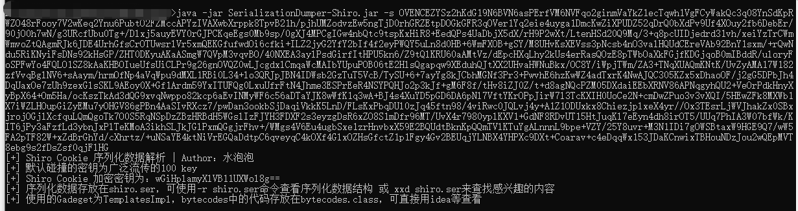
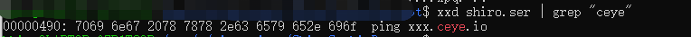
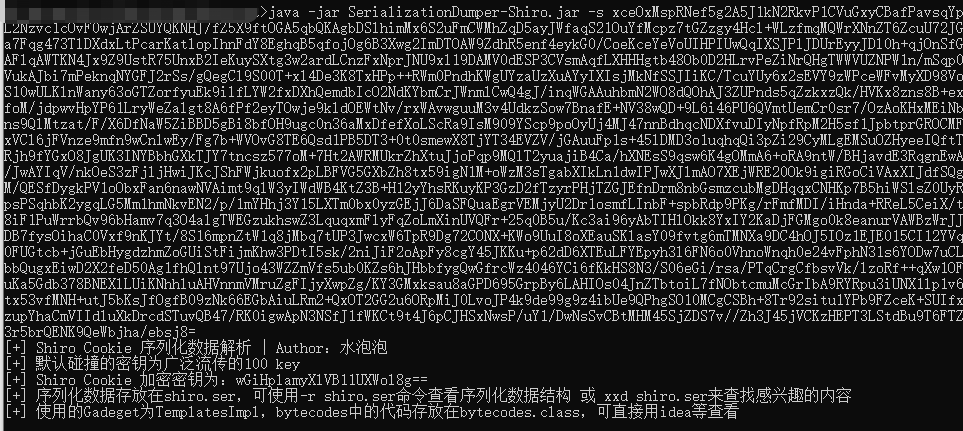
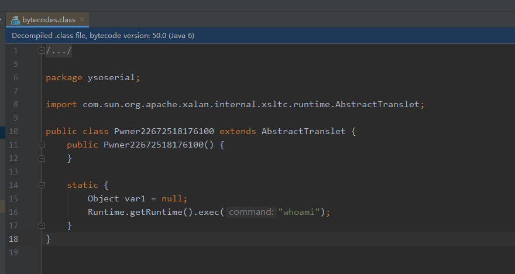
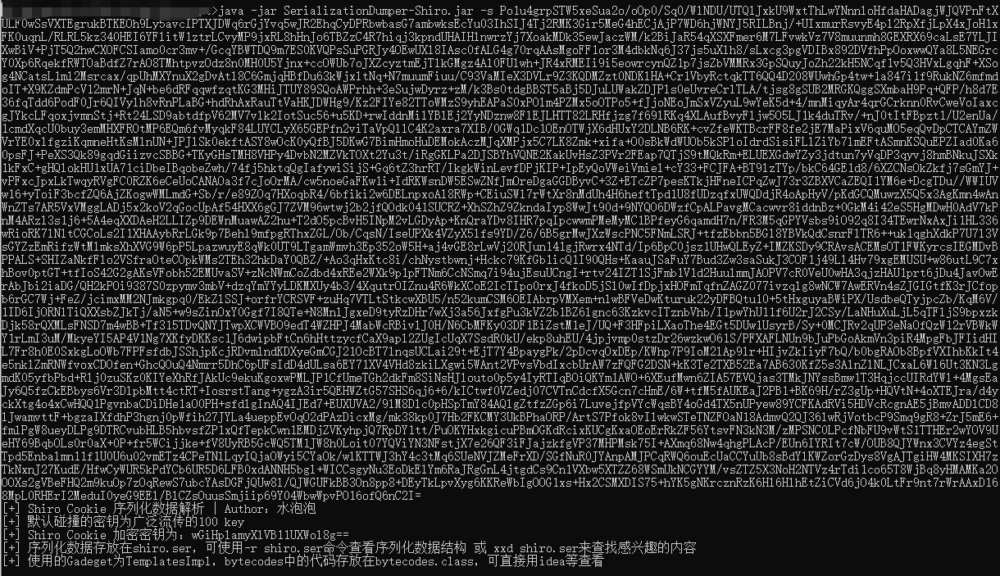
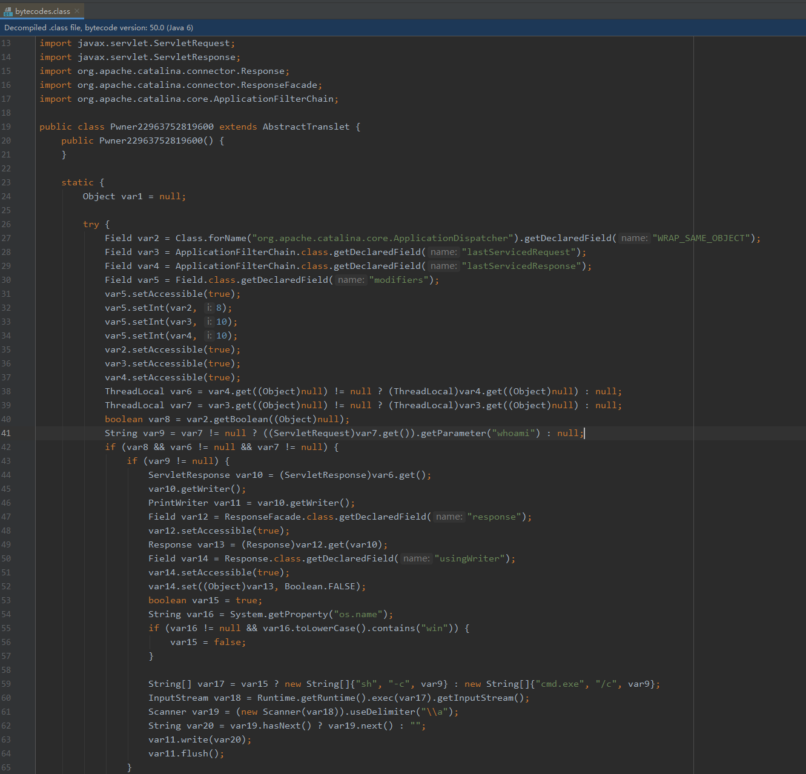

## SerializationDumper-Shiro

ShiroCookie解密小工具，基于[SerializationDumper](https://github.com/NickstaDB/SerializationDumper)

### 代码逻辑

用100key碰撞解密，再用`SerializationDumper`把数据`dump`出来

### 使用说明

基础用法：`java -jar SerializationDumper-Shiro.jar -s shiro_cookie_base64_data`

链子简单分为两种情况：

- 非基于`TemplatesImpl`的链子，则直接用`xxd`查找关键字即可
- 基于`TemplatesImpl`的链子，关注点在`_bytecodes`字段的代码

#### 一、非`TemplatesImpl`的链子，使用cc1链的shio cookie

加密key为：`wGiHplamyXlVB11UXWol8g==`

`xxd` 查找

#### 二、使用cc2链的shiro cookie

加密key为：`wGiHplamyXlVB11UXWol8g==`

查看`bytecodes.class`

使用`tomcat`回显链

`bytecodes.class`

### 参考

- [java反序列化提取payload之Xray高级版的shiro回显poc的提取过程](https://mp.weixin.qq.com/s/EBH3pfFKx4vwCy1Z7h_DcQ)

